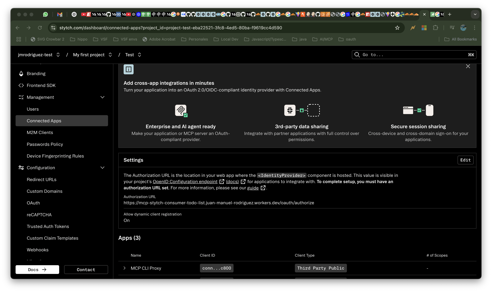

# Workers + Stytch TODO App MCP Server

This is a Workers server that composes three functions:
* A static website built using React and Vite on top of [Worker Assets](https://developers.cloudflare.com/workers/static-assets/)
* A REST API built using Hono on top of [Workers KV](https://developers.cloudflare.com/kv/) 
* A [Model Context Protocol](https://modelcontextprotocol.io/introduction) Server built using on top of [Workers Durable Objects](https://developers.cloudflare.com/durable-objects/)

User and client identity is managed using [Stytch](https://stytch.com/). Put together, these three features show how to extend a traditional full-stack application for use by an AI agent.

This demo uses the [Stytch Consumer](https://stytch.com/b2c) product, which is purpose-built for Consumer SaaS authentication requirements.
If you are more interested in Stytch's [B2B](https://stytch.com/b2b) product, see [this demo](https://github.com/stytchauth/mcp-stytch-b2b-okr-manager/) instead.


## Set up

Follow the steps below to get this application fully functional and running using your own Stytch credentials.

### In the Stytch Dashboard

1. Create a [Stytch](https://stytch.com/) account. Within the sign up flow select **Consumer Authentication** as the authentication type you are interested in. Once your account is set up a Project called "My first project" will be automatically created for you.

2. Navigate to [Frontend SDKs](https://stytch.com/dashboard/sdk-configuration?env=test) to enable the Frontend SDK in Test

3. Navigate to [Connected Apps](https://stytch.com/dashboard/connected-apps?env=test) to enable Dynamic Client Registration

4. Navigate to [Project Settings](https://stytch.com/dashboard/project-settings?env=test) to view your Project ID and API keys. You will need these values later.

### On your machine

In your terminal clone the project and install dependencies:

```bash
git clone https://github.com/stytchauth/mcp-stytch-consumer-todo-list.git
cd mcp-stytch-consumer-todo-list
npm i
```

Next, create an `.env.local` file by running the command below which copies the contents of `.env.template`.

```bash
cp .env.template .env.local
```

Open `.env.local` in the text editor of your choice, and set the environment variables using the `public_token` found on [Project Settings](https://stytch.com/dashboard/project-settings?env=test).

```
# This is what a completed .env.local file will look like
VITE_STYTCH_PUBLIC_TOKEN=public-token-test-abc123-abcde-1234-0987-0000-abcd1234
```

Create a `.dev.vars` file by running the command below which copies the contents of `.dev.vars.template`

```bash
cp .dev.vars.template .dev.vars
```

Open `.dev.vars` in the text editor of your choice, and set the environment variables using the `Project ID`, `Secret`, and `Project Domain`  found on [Project Settings](https://stytch.com/dashboard/project-settings?env=test).

```
// This is what a completed .dev.vars file will look like
STYTCH_PROJECT_ID=project-test-6c20cd16-73d5-44f7-852c-9a7e7b2ccf62
STYTCH_SECRET=your-stytch-secret-key
STYTCH_DOMAIN=https://cname-word-1234.customers.stytch.dev
```

## Running locally

After completing all the setup steps above the application can be run with the command:

```bash
npm run dev
```

The application will be available at [`http://localhost:3000`](http://localhost:3000) and the MCP server will be available at `http://localhost:3000/sse`.

Test your MCP server using the [MCP Inspector](https://modelcontextprotocol.io/docs/tools/inspector)
```bash
npx @modelcontextprotocol/inspector@latest
```

##  Deploy to Cloudflare Workers

Click the button - **you'll need to configure environment variables after the initial deployment**. 

[](https://deploy.workers.cloudflare.com/?url=https://github.com/stytchauth/mcp-stytch-consumer-todo-list.git)

Or, if you want to follow the steps by hand: 

1. Create a KV namespace for the TODO app to use

```
wrangler kv namespace create TODOS
```

2. Update the KV namespace ID in `wrangler.jsonc` with the ID you received:

```
"kv_namespaces": [
   {
      "binding": "TODOS",
      "id": "your-kv-namespace-id"
   }
]
```


3. Upload your Stytch Env Vars for use by the worker

```bash
npx wrangler secret bulk .dev.vars
```

4. Deploy the worker

```
npm run deploy
```

5. Grant your deployment access to your Stytch project. Assuming your Stytch project was deployed at `https://mcp-stytch-consumer-todo-list.$YOUR_ACCOUNT_NAME.workers.dev`:
   1. Add `https://mcp-stytch-consumer-todo-list.$YOUR_ACCOUNT_NAME.workers.dev/authenticate` as an allowed [Redirect URL](https://stytch.com/dashboard/redirect-urls?env=test)
   2. Add `https://mcp-stytch-consumer-todo-list.$YOUR_ACCOUNT_NAME.workers.dev` as an allowed Authorized Application in the [Frontend SDKs](https://stytch.com/dashboard/sdk-configuration?env=test) configuration

6. Setup Authorization URL (https://mcp-stytch-consumer-todo-list.juan-manuel-rodriguez.workers.dev/oauth/authorize

)




## Get help and join the community

#### :speech_balloon: Stytch community Slack

Join the discussion, ask questions, and suggest new features in our [Slack community](https://stytch.com/docs/resources/support/overview)!

